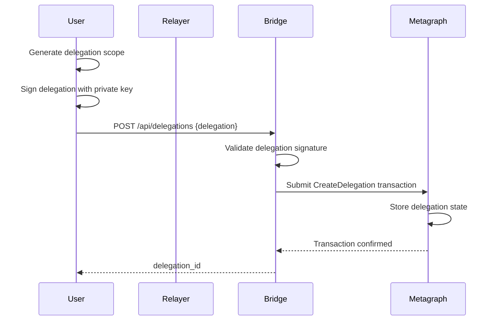
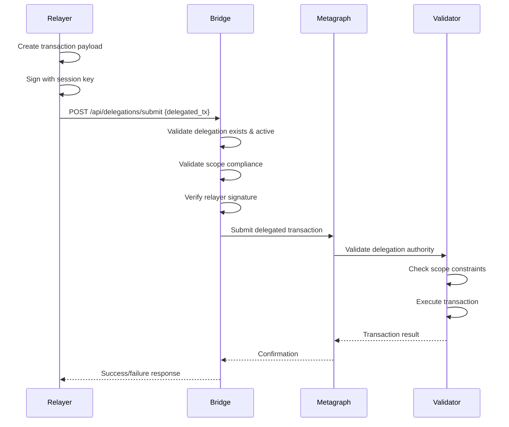
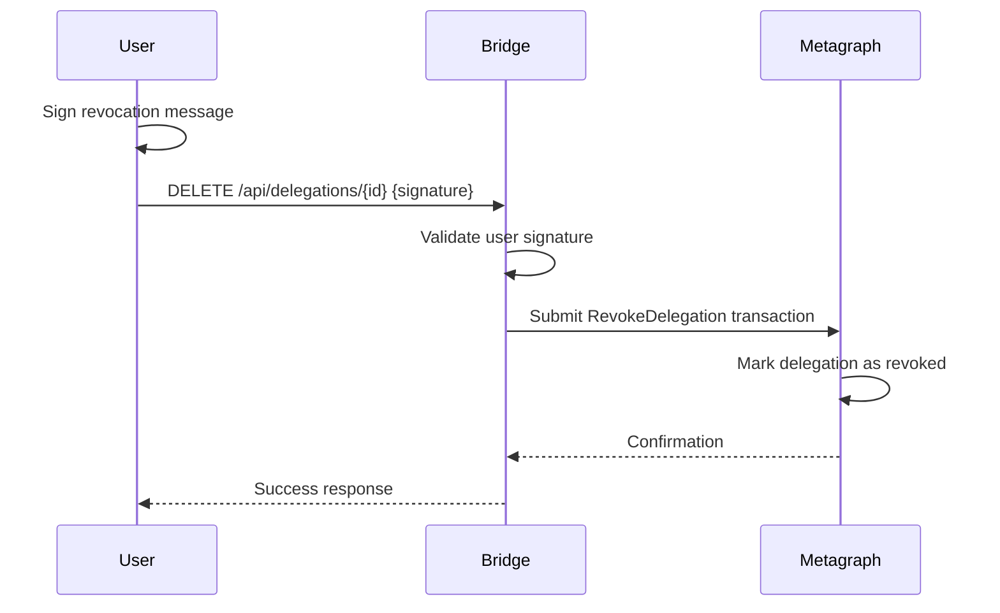

# Delegation Protocol Specification

## Overview

The OttoChain delegation protocol enables users to grant limited transaction authority to relayers (third parties) without exposing their primary private keys. This implements a session key pattern where relayers can submit transactions on behalf of users within defined scope limitations.

## Architecture

### Core Components

1. **Delegator**: User who owns assets and grants delegation authority
2. **Relayer**: Service that submits transactions on behalf of delegators
3. **Delegation Authority**: Signed permission structure defining scope and limits
4. **Session Key**: Relayer's key pair used to sign delegated transactions

### Trust Model

- Users trust relayers to operate within granted scope only
- Relayers cannot exceed delegation permissions
- Network validators enforce scope limitations at consensus level
- All delegation operations are cryptographically verifiable

## Protocol Flow

### 1. Delegation Creation



#### Process

1. User defines delegation scope (time limits, spending limits, allowed operations)
2. User signs delegation structure with their private key
3. Bridge validates delegation signature and structure
4. Delegation is submitted to metagraph for storage
5. Delegation becomes active and returns unique ID

### 2. Delegated Transaction Submission



#### Process

1. Relayer creates transaction payload targeting user's assets
2. Relayer signs transaction with their session key
3. Bridge receives delegated transaction and validates:
   - Delegation exists and is active
   - Transaction complies with delegation scope
   - Relayer signature is valid
4. Validated transaction is submitted to metagraph
5. Metagraph validators perform additional scope validation
6. Transaction is executed if all validations pass

### 3. Delegation Revocation



## Scope Validation

### Time Window Validation

```typescript
function isTimeWindowValid(delegation: Delegation, currentTime: Timestamp): boolean {
  const scope = delegation.scope.timeWindow;
  return currentTime >= scope.startTime && currentTime <= scope.endTime;
}
```

### Transaction Type Validation

```typescript
function isTransactionTypeAllowed(scope: DelegationScope, txType: string): boolean {
  if (scope.allowedTransactionTypes.length === 0) return true; // Empty means all allowed
  return scope.allowedTransactionTypes.includes(txType);
}
```

### Spending Limit Validation

```typescript
function isSpendingWithinLimit(scope: DelegationScope, assetType: string, amount: bigint): boolean {
  const limit = scope.spendingLimits.find(l => l.assetType === assetType);
  if (!limit) return false; // No limit defined for this asset type
  
  const maxAmount = BigInt(limit.maxAmount);
  const currentUsed = BigInt(limit.currentUsed);
  
  return (currentUsed + amount) <= maxAmount;
}
```

### Fiber Access Validation

```typescript
function isFiberAllowed(scope: DelegationScope, fiberId: string): boolean {
  if (scope.allowedFiberIds.length === 0) return true; // Empty means all allowed
  return scope.allowedFiberIds.includes(fiberId);
}
```

## Security Considerations

### Replay Attack Prevention

- All delegated transactions include monotonic nonces
- Nonces are tracked per delegation to prevent reuse
- Expired delegations cannot be reused even with valid nonces

### Signature Validation

- Delegation creation requires delegator's signature
- Delegated transactions require relayer's signature
- All signatures use standard OttoChain signing algorithms
- Public key recovery validates signature authenticity

### Scope Enforcement

- All scope limitations are enforced at multiple layers:
  - Bridge API validation (performance optimization)
  - Metagraph consensus validation (security enforcement)
  - JSON Logic Virtual Machine integration (complex policies)

### Key Management

- Users never share their primary private keys
- Relayers generate ephemeral key pairs for each delegation
- Session keys can be rotated by creating new delegations
- Compromised session keys have limited impact due to scope restrictions

## Error Handling

### Validation Errors

| Error Type | Description | Recovery Action |
|------------|-------------|-----------------|
| DELEGATION_NOT_FOUND | Referenced delegation doesn't exist | Check delegation ID |
| DELEGATION_EXPIRED | Delegation past expiration time | Create new delegation |
| DELEGATION_REVOKED | User revoked the delegation | Create new delegation |
| INVALID_SIGNATURE | Signature verification failed | Check key material |
| SCOPE_VIOLATION | Transaction outside permitted scope | Modify transaction or expand scope |
| SPENDING_LIMIT_EXCEEDED | Transaction would exceed spending limits | Wait for limit reset or increase limit |

### Rate Limiting

- Delegated transactions subject to standard rate limits
- Multiple relayers for same user share rate limit quotas
- Revoked delegations immediately stop accepting new transactions

## Integration Points

### JSON Logic Virtual Machine

Delegation validation can integrate with OttoChain's JLVM for complex policies:

```json
{
  "and": [
    {">=": [{"var": "delegation.expiresAt"}, {"var": "now"}]},
    {"in": [{"var": "transaction.type"}, {"var": "delegation.scope.allowedTypes"}]},
    {"<=": [
      {"+": [{"var": "delegation.scope.currentSpent"}, {"var": "transaction.amount"}]},
      {"var": "delegation.scope.maxAmount"}
    ]}
  ]
}
```

### Bridge API Integration

Standard REST endpoints for delegation management:

- `POST /api/delegations` - Create delegation
- `GET /api/delegations` - Query delegations
- `DELETE /api/delegations/{id}` - Revoke delegation
- `POST /api/delegations/submit` - Submit delegated transaction

### Metagraph State Integration

Delegation state is stored in metagraph state:

```scala
case class DelegationState(
  activeDelegations: Map[String, Delegation],
  revokedDelegations: Set[String],
  usageTracking: Map[String, DelegationUsage]
)
```

## Use Cases

### Mobile Application

User grants delegation to mobile app for small transactions:

```typescript
const delegation = {
  delegatorAddress: "user_address",
  relayerPublicKey: "mobile_app_key",
  scope: {
    timeWindow: { startTime: now, endTime: now + 24_hours },
    spendingLimits: [{ assetType: "DAG", maxAmount: "100.0", currentUsed: "0" }],
    allowedTransactionTypes: ["transfer", "fiber_transition"],
    maxTransactionCount: 50
  },
  expiresAt: now + 24_hours
};
```

### Trading Bot

User grants delegation to trading bot for market operations:

```typescript
const tradingDelegation = {
  delegatorAddress: "trader_address", 
  relayerPublicKey: "bot_service_key",
  scope: {
    timeWindow: { startTime: now, endTime: now + 7_days },
    allowedFiberIds: ["market_fiber_id_1", "market_fiber_id_2"],
    allowedTransactionTypes: ["market_commit", "market_claim"],
    spendingLimits: [{ assetType: "DAG", maxAmount: "1000.0", currentUsed: "0" }],
    maxTransactionCount: 1000
  },
  expiresAt: now + 7_days
};
```

### Subscription Service

User grants delegation for recurring payments:

```typescript
const subscriptionDelegation = {
  delegatorAddress: "subscriber_address",
  relayerPublicKey: "service_provider_key", 
  scope: {
    timeWindow: { startTime: now, endTime: now + 30_days },
    allowedTransactionTypes: ["transfer"],
    spendingLimits: [{ assetType: "DAG", maxAmount: "50.0", currentUsed: "0" }],
    maxTransactionCount: 30  // Daily payments
  },
  expiresAt: now + 30_days
};
```

## Implementation Checklist

### Protocol Schema ✅
- [x] Protobuf definitions for delegation structures
- [x] Delegation scope and validation types  
- [x] Error handling and response types
- [x] Service definition for gRPC/REST mapping

### Next Implementation Steps
- [ ] JSON Logic operators for delegation validation (JLVM)
- [ ] Bridge API endpoints implementing delegation service  
- [ ] Metagraph integration for delegation state management
- [ ] SDK methods for delegation creation and management
- [ ] End-to-end testing with real delegation workflows

## Version History

- v1.0.0: Initial delegation protocol specification
- Protobuf schema version: ottochain.apps.delegation.v1